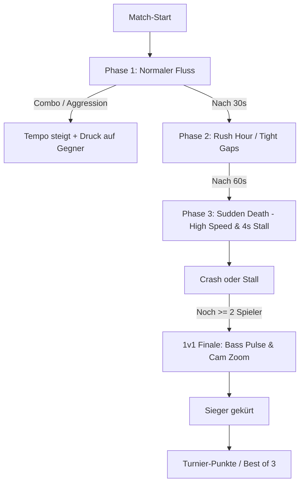

# Masterplan: Multiplayer-Perfektionierung („Last One Standing“)

Dieser Plan analysiert den aktuellen Stand des Multiplayers in Car Game, deckt alle Schwachstellen und Immersionsbrüche auf und definiert ein ganzheitliches Konzept aus **6 Kernsäulen**, um den Modus von einer simplen technischen P2P-Demo in ein fesselndes, hochgradig kompetitives Party-Erlebnis zu verwandeln.

---

## 1. Status Quo & Wurzelfehler („Warum fühlt es sich unfertig an?“)

Aktuell basiert der Multiplayer auf:
- Deterministic Lockstep über PeerJS WebRTC ([Web/src/net/room.ts](file:///c:/Users/Einrichtung/Documents/GitHub/Car-game/Web/src/net/room.ts))
- Fester 120-Hz-Simulation mit 50 ms Eingabeverzögerung ([Web/src/present/versus.ts](file:///c:/Users/Einrichtung/Documents/GitHub/Car-game/Web/src/present/versus.ts))
- Bis zu 4 Spielern an einem 8-armigen Kreisverkehr ([Web/src/core/versus.ts](file:///c:/Users/Einrichtung/Documents/GitHub/Car-game/Web/src/core/versus.ts))

### Die 5 fundamentalen Probleme:
1. **Das Camper-Dilemma (Fehlender Spielantrieb):**
   Es gibt keine Punkte, keine Combos, keine Belohnung für Aggressivität. Wer vorsichtig alle 9 Sekunden genau 1 Auto sendet, gewinnt. Crasht jemand, stoppt die Stall-Uhr sogar ganz. Das Spiel belohnt Untätigkeit.
2. **Keine visuelle Zuordnung der Autos:**
   Alle Autos sehen gleich aus ([Web/src/present/scene.ts](file:///c:/Users/Einrichtung/Documents/GitHub/Car-game/Web/src/present/scene.ts#L235)). Sobald ein Auto auf den Ring einfädelt, kann kein Spieler mehr erkennen, wessen Auto dort fährt.
3. **Akustische und haptische Leere:**
   Multiplayer schaltet die Musik stumm (`Music.silent` in [Web/src/ui/shell.ts](file:///c:/Users/Einrichtung/Documents/GitHub/Car-game/Web/src/ui/shell.ts#L444)). Es gibt keine Launch-Sounds, keine Merge-Sounds, keine Haptik und keine akustischen Eliminierungs-Hinweise.
4. **Input-Lag & Trägheit:**
   Gäste tippen auf den Screen, aber das Auto fährt erst los, wenn das Paket zum Host und zurück gelaufen ist. Ohne lokale Vorhersage oder sofortiges Feedback (Lichthupe/Sound) fühlt sich die Steuerung zäh und schwammig an.
5. **„Dead & Bored“-Spectating:**
   Wer nach 5 Sekunden crasht, starrt bis zu 2 Minuten lang regungslos auf den Bildschirm, ohne Einfluss oder Unterhaltung.

---

## 2. Säule I: Game-Design & Nervenkitzel (Gameplay-Loop)



### 2.1 Dynamische Eskalation (Anti-Camping & Sudden Death)
- **Problem:** Das Tempo bleibt konstant, das Match kann sich endlos ziehen.
- **Lösung:**
  - **Match-Timer & Tempo-Glide:**
    - Nach 30 Sekunden: Kreisverkehr-Tempo steigt um +15%, KI-Verkehr verdichtet sich leicht.
    - Nach 60 Sekunden (**Sudden Death**): Tempo steigt um +30%, die Stall-Uhr sinkt von 10 s auf **4 s**, Warn-Sirene ertönt.
  - **Aktiver Stall-Timer:** Die Uhr darf bei Crashs nicht komplett pausieren, sondern nur um max. 3 Sekunden puffern, um Endlos-Pausen durch Wracks zu verhindern.

### 2.2 Risiko & Belohnung (Combos & Interaktion)
- **Multiplayer-Punkte / Combo-System:**
  - Jedes erfolgreiche Einfädeln füllt eine persönliche **Druck-Leiste** (oder Combo-Multiplikator).
  - **Near Miss / Tight Fit Bonus:** Wer riskant einfädelt, schickt ein schnelles Sportauto oder einen schweren Lkw auf den Ring, der direkt auf die Zufahrten der Gegner zusteuert.
  - **Streak-Vorteil:** Bei 5 perfekten Merges in Folge erhält man ein „Ghost Shield“ (einmaliger Schutz vor einem leichten Stoßstangen-Crash).

### 2.3 Runden- & Turniersystem (Best-of-N)
- Anstelle einzelner isolierter Matches:
  - Einstellbar: **Einzelmatch**, **Best-of-3** oder **Best-of-5**.
  - Punktetafel nach jeder Runde:
    - 1. Platz: 3 Punkte
    - 2. Platz: 2 Punkte
    - 3. Platz: 1 Punkt
    - Sonderpunkte: „Meiste Autos eingeschleust“, „Riskantestes Einfädeln“.
  - Sichtbare Kronen/Trophäen (z. B. `👑 2 - 1 - 0`).

---

## 3. Säule II: Visuelle Klarheit & Player Identity

```
Spieler 1:  [#00F5D4] Mint / Cyan     (Akzentfarbe 1)
Spieler 2:  [#FF5964] Coral / Flamme   (Akzentfarbe 2)
Spieler 3:  [#9D4EDD] Violett / Purple (Akzentfarbe 3)
Spieler 4:  [#FFD166] Neongelb / Gold  (Akzentfarbe 4)
```

### 3.1 Farbcodierung der Autos auf dem Ring
- Autos, die von Spieler-Lanes stammen, behalten die Primärfarbe des jeweiligen Spielers auf dem Dach oder als markanten Rennstreifen ([Web/src/present/carArt.ts](file:///c:/Users/Einrichtung/Documents/GitHub/Car-game/Web/src/present/carArt.ts)).
- Ein dezenter Neon-Unterboden-Glow (`shadow` mit Spielerfarbe) oder ein kleiner Spieler-Indikator über dem Auto zeigt genau, welches Fahrzeug von wem gesteuert wird.
- Zufahrtsspuren und Stopplinien leuchten in der jeweiligen Spielerfarbe.

### 3.2 Live-Match-HUD (Spannungsaufbau)
- **Dynamische Rangliste am oberen Bildschirmrand:**
  - Zeigt alle 4 Spieler mit Avatar/Farbe, Status (Aktiv, Gefahr, Ausgeschieden) und Anzahl geschickter Autos.
  - Bei Stall-Gefahr (< 3 s) pulsiert das Spieler-Badge rot.
- **Kamera-Dynamik:**
  - Scheiden Spieler aus, passt die Kamera den Zoom leicht an, um den Fokus auf die verbleibenden Kontrahenten zu richten.
  - Im 1v1-Finale: Leichter cineastischer Zoom auf den Kreisverkehr.

---

## 4. Säule III: Audiovisuelles Feedback & Saftigkeit („Juiciness“)

### 4.1 Sofortiges Input-Feedback (Gegen das Trägheitsgefühl)
- **Das Problem:** Bei 100 ms Ping vergehen 150 ms bis sich das Auto physisch bewegt.
- **Die Lösung (Client-Side Anticipation):**
  - Sobald der Finger das Display berührt:
    1. **Haptik:** Sofortiger 12-ms-Impuls (`vibrate(12)`).
    2. **Audio:** Sofortiger Klick/Pedal-Sound (`uiTick` oder tiefer Motor-Rev).
    3. **Licht:** Scheinwerfer / Lichthupe des wartenden Autos flashen sofort auf!
    4. **Karosserie:** Das Auto senkt sich minimal nach vorne (Einfeder-Animation / Launch-Anticipation).
  - Der Spieler spürt *null* Latenz, weil das Spiel sofort reagiert – die anschließende Bewegung wirkt wie die natürliche Trägheit des Motors.

### 4.2 Akustische Inszenierung
- **Adaptive Musik im Multiplayer:**
  - Nicht stummschalten! Die Bass- und Drum-Stems aus [Web/src/audio/player.ts](file:///c:/Users/Einrichtung/Documents/GitHub/Car-game/Web/src/audio/player.ts) laufen synchron mit.
  - Bei < 2 verbleibenden Spielern filtert die Musik durch einen Tiefpass (Pulsieren / Herzschlag-Effekt).
- **Sound-Events:**
  - Countdown: 3 ... 2 ... 1 (tiefe Beeps) -> GO! (hoher Gong + Bassdrop).
  - Merge-Sounds: Bei jedem erfolgreichen Einfädeln ertönt der befriedigende `merge`- oder `tightFit`-Sound.
  - Eliminierungs-Gong: Wenn ein Mitspieler crasht, hören *alle* ein sattes Crash-Echo und einen metallischen Gong.
  - Siegesfanfare & Konfetti-Partikel beim Gewinner.

---

## 5. Säule IV: Spectator-Modus & Revanche

### 5.1 Aktives Zuschauen („Geister-Einfluss“)
Damit ausgeschiedene Spieler nicht das Smartphone weglegen:
- **Kamera-Verfolgung:** Ausgeschiedene können durch Antippen zwischen den aktiven Spielern durchwechseln.
- **Geister-Hupe / Reaktionen:** Ausgeschiedene können Hupen-Stakkato oder kleine visuelle Emojis (🔥, 💀, 👏) an den Kreisverkehr senden.
- **Optionale Hazard-Rache:** Jeder ausgeschiedene Spieler darf 1x pro Match eine Ölspur oder einen Bot-LKW auf die Strecke rufen, um das Match aufzumischen.

### 5.2 Schnell-Revanche
- Nach Matchende: 5-Sekunden-Countdown für sofortigen Neustart mit denselben Freunden.
- Synchronisierter „Bereit“-Button, damit der Host das Spiel nicht unangekündigt startet, während andere kurz abgelenkt sind.

---

## 6. Säule V: Lobby, Social Friction & Onboarding

### 6.1 One-Click-Share (WhatsApp, Discord, iMessage)
- **Bisher:** 4-stelligen Code ansagen, Freund muss App öffnen, 4 Tabs wischen, Code tippen.
- **Neu:**
  - Share-Button in der Lobby: Nutzt `navigator.share()` oder kopiert Link:
    `https://spiel.url/#join=1234`
  - Beim Klick auf den Link öffnet sich die Web-App und tritt dem Raum vollautomatisch bei.

### 6.2 Spielernamen & Bots
- **Eigener Nickname:** Direkt in der Lobby editierbar (wird in `localStorage` gemerkt).
- **Bots hinzufügen (+ Bot):**
  - Wenn man nur zu zweit ist, kann der Host leere Slots mit cleveren KI-Bots auffüllen ([Web/scripts/versus-sim.mjs](file:///c:/Users/Einrichtung/Documents/GitHub/Car-game/Web/scripts/versus-sim.mjs#L14)).
  - Erlaubt es auch Solospielern, den Versus-Modus offline gegen 3 Bots zu trainieren!

---

## 7. Säule VI: Robuste Netzwerk-Architektur (WebRTC / TURN)

### 7.1 Das Mobilfunk-NAT-Problem
- **Problem:** PeerJS verwendet standardmäßig nur STUN (`stun:stun.l.google.com:19302`). Im deutschen Mobilfunknetz (Telekom/Vodafone/O2 mit Symmetric NAT / CGNAT) schlagen bis zu 40% der direkten P2P-Verbindungen fehl.
- **Lösung:**
  - Konfigurierbare STUN/TURN-Serverliste in [Web/src/net/room.ts](file:///c:/Users/Einrichtung/Documents/GitHub/Car-game/Web/src/net/room.ts):
    ```ts
    const peerConfig = {
      config: {
        iceServers: [
          { urls: 'stun:stun.l.google.com:19302' },
          { urls: 'stun:stun1.l.google.com:19302' },
          // Optionale TURN-Server für Fallback bei Mobilfunk-Firewalls
        ]
      }
    };
    ```

### 7.2 Ping- & Qualitäts-Anzeige
- Ein kleiner Ping-Indikator im HUD (z. B. `🟢 32ms`, `🟡 110ms`, `🔴 240ms`).
- So sehen alle Spieler sofort, ob Verzögerungen am Netzwerk eines bestimmten Mitspielers liegen.

---

## 8. Detaillierter Umsetzungs-Fahrplan

| Phase | Fokus | Konkrete Maßnahmen |
|---|---|---|
| **Phase 1** | **Feedback & Spielgefühl** | • Musik im Multiplayer aktivieren<br>• Merge-Sounds & Countdown-Sounds einbinden<br>• Sofortiges Haptik- und Scheinwerfer-Feedback beim Tippen |
| **Phase 2** | **Visuelle Identität** | • 4 distincte Spielerfarben für Karosserie & Dachstreifen<br>• Neon-Glow / HUD-Badges über Spielerautos<br>• Farbige Startspuren & Stoplinien |
| **Phase 3** | **Spannung & Dynamik** | • Match-Timer mit Tempo-Steigerung nach 30s & 60s<br>• Sudden-Death-Modus mit 4s Stall-Limit<br>• Belohnung für risikoreiches Einfädeln |
| **Phase 4** | **Lobby & Social** | • One-Click-Share-Link (`#join=CODE`)<br>• Spielernamen editierbar & speicherbar<br>• „Bot hinzufügen“-Funktion für Training oder Auffüllen |
| **Phase 5** | **Turnier & Spectating** | • Best-of-3 / Best-of-5 Modus mit Kronen-Wertung<br>• Ausgeschiedene können Kamera wechseln & Geister-Hupe nutzen<br>• Detaillierte Endstatistik (Reaktionszeit, Merges, Crashes) |
| **Phase 6** | **Netzwerk-Härtung** | • TURN-Server Fallback für Mobilfunk<br>• Ping-Anzeige im HUD<br>• Graceful Host-Migration / Reconnect |
